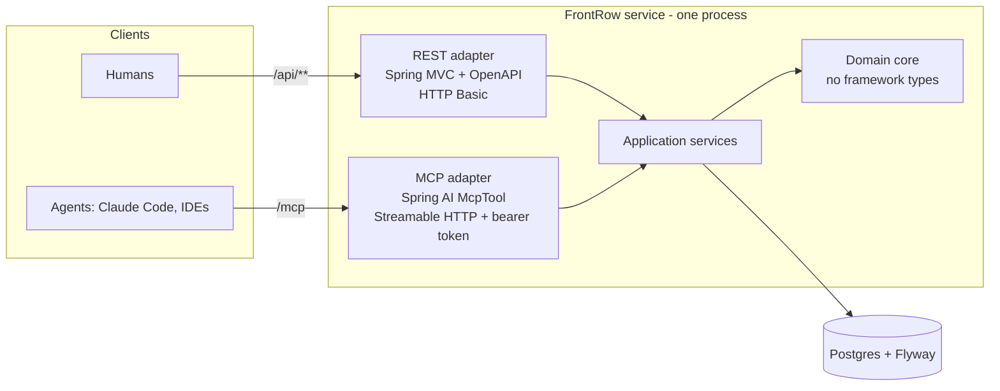
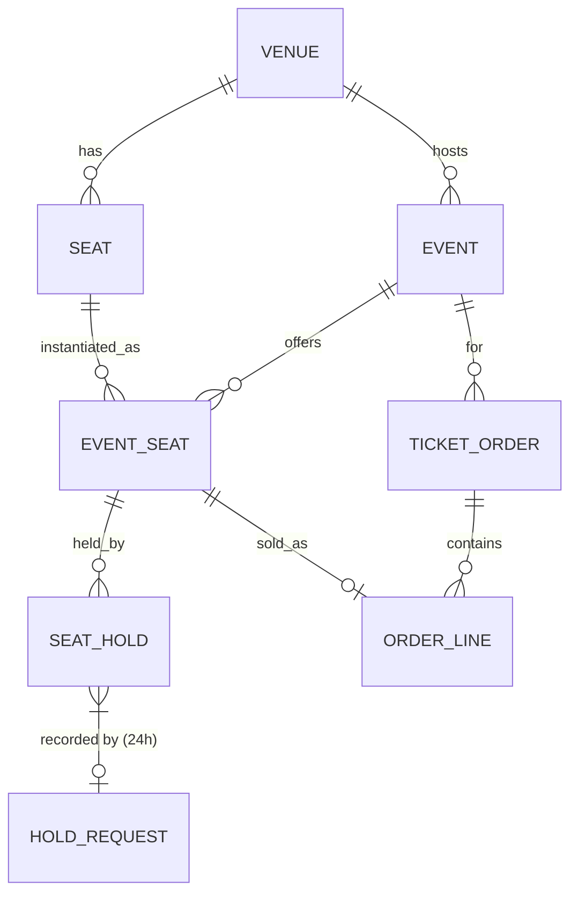

# FrontRow — Design Spec

**Date:** 2026-09-17 · **Revised:** 2026-09-18 (revision 2 — see §14)
**Status:** Under user review. Not yet implemented — no code exists.
**Tier:** Standard overall. The security slices — REST authorization, MCP
caller authentication, and the agent-to-human hold handover (§6) — are
**Mandatory** tier, since they are auth work behind a published tool contract.
**Revisions 2.1–2.6** (same day) apply the review rounds — see §14.

---

## 1. Why this project exists

FrontRow is a portfolio project with two specific, evidence-backed goals.

**Goal 1 — back an unbacked resume claim.** `Java` is listed under Backend
skills on the resume with no supporting project or work bullet. Infor was LPL
(Infor's proprietary language), RBC is SDET work in Playwright/Postman/
OpenShift, the SAIT capstone was Next.js, and Carpool was Laravel/PHP. Every
other listed skill has a bullet under it; Java is the one load-bearing claim
with nothing attached. This project converts it into a demonstrated skill.

**Goal 2 — demonstrate MCP server design, not just MCP usage.** Existing
portfolio work (The Fourth Official) covers the AI *consumer* side: retrieval,
evals, grounded generation. FrontRow covers the *provider* side: designing an
agent-facing API, tool boundaries, and guardrails on write operations.

These are one project rather than two because the architecture genuinely unites
them (see §3). The portfolio currently contains four JavaScript/TypeScript
projects and zero compiled-language backend services, so this fills a real gap
rather than adding a fifth variation of the same signal.

### Research basis

Design decisions below trace to published 2026 hiring signals:

- Implementation quality outranks idea originality; production hygiene (auth,
  real tests, containerization, DB migrations, concrete README metrics) is what
  gets evaluated.
- **Testcontainers** is repeatedly named as *the* differentiator separating
  strong from weak Spring developers — meaningful integration tests against a
  real database rather than mocking everything.
- **Observability** is absent from roughly 70% of Java resumes (Micrometer,
  Prometheus, Grafana, tracing) — a cheap differentiator, scheduled as Phase 2.
- A credible MCP portfolio has a specific published bar: typed JSON schemas
  checked into the repo, **at least one logged tool failure**, thin
  single-responsibility tools, structured error contracts, an architecture
  diagram with a threat model, and measured tool success rate / p95 latency.
  Weak signals are happy-path-only demos, "mega-tools" hiding business logic,
  unstructured output, and MCP on a resume with no server repo.

The MCP bar is, in substance, a testing-and-observability checklist. That plays
directly to SDET experience while reading as current AI work.

---

## 2. Goals and non-goals

### Goals

1. A working Spring Boot service with a defensible domain model and real
   business invariants.
2. Double-booking made **structurally impossible**, proven by a concurrency
   test against real Postgres.
3. An MCP server exposing the same domain, meeting the published credibility
   bar including a logged failure case.
4. Something complete and presentable within roughly one focused week.

### Non-goals

- **No frontend in Phases 1–3.** OpenAPI/Swagger UI plus seeded demo data plus the MCP server
  is the demo. Four existing portfolio projects already prove frontend ability;
  this one is deliberately backend-only so effort concentrates on the gap.
- **No real payments.** Order confirmation is simulated. Handling real payment
  credentials is out of scope and would add compliance surface for no portfolio
  gain.
- **No order cancellation or refunds.** A confirmed order is final. This is a
  consequence of §5, not an omission: the sold-once guarantee is a permanent
  constraint, and cancellation would require relaxing it deliberately. The
  future change is stated in §5 so it is a documented extension, not a trap.
- **No recurring performances.** One event = one datetime at one venue. A
  multi-performance model is a documented future enhancement, not a hidden gap.
- **No venue or seat-map management.** Venues and their seats are seed data.
  Organisers create events on existing venues; they do not draw seat maps.
- **No public deployment in Phase 1.** Demo-grade credentials (§9) on a public
  URL would overstate the security story. Phase 1 runs locally via
  `docker compose`; a hosted deploy follows real authentication.
- **No Kafka, observability stack, or OAuth2 in Phase 1.** All three are
  in-demand and all three are scheduled later (§9). Including them in a
  one-week Phase 1 produces a half-finished everything, which the research
  says is strictly worse than a small complete thing.

---

## 3. Architecture

A domain core with two inbound adapters. The core has no Spring Web types and
no MCP types in it; both adapters are thin translation layers over the same
application services. **Both adapters are HTTP, in one process** (§10 explains
why stdio was dropped), each behind its own security filter chain.



**The load-bearing sentence:** MCP is just another inbound adapter — the domain
does not know it exists. A Java reviewer reads ports-and-adapters discipline; an
AI-platform reviewer reads a correct understanding of MCP as an interface layer
rather than a magic AI feature.

**Practical consequence for review:** if a change to an MCP tool requires
changing anything under the domain core, the boundary has leaked. That is a
concrete, checkable review criterion, not an aspiration.

### Caller identity

Every write is attributed to an **owner** — a named user. There is one identity
model with two credential types:

| Adapter | Credential | Resolves to |
|---|---|---|
| REST `/api/**` | HTTP Basic (username + password) | the user |
| MCP `/mcp` | Bearer token issued to a user's agent | the same user |

The two filter chains are disjoint: `/api/**` rejects bearer tokens, `/mcp`
rejects Basic credentials. Spring's Basic filter silently ignores a `Bearer`
header, so it doesn't do this rejection on its own. `/api/**` has an explicit
filter that returns 401 for any request carrying `Authorization: Bearer`, on
anonymous endpoints too. That separation is what makes the threat model in §6
enforceable rather than aspirational — an agent token cannot reach the purchase
endpoint at all. No tool parameter carries identity; the owner always comes from
the authenticated principal.

An MCP token carries **no role of its own**. Tokens are issued only to users
who hold `BUYER`, and the MCP chain grants the token a single `AGENT` authority
that is scoped to `/mcp`. An organiser's or admin's powers are never reachable
through an agent token.

Everything outside the two chains is closed by default, except for three
anonymous paths: Swagger UI (`/swagger-ui/**`, `/v3/api-docs/**`), `/error`,
and `/actuator/health`. No other actuator endpoint is exposed in Phase 1.

**Scaffold spike — must pass before the plan depends on it.** Spring AI's
Streamable HTTP transport may run `@McpTool` methods on a thread where
`SecurityContextHolder` is empty. The first task after the scaffold proves how
the authenticated principal reaches a tool method: the security context, or
Spring AI's MCP transport or request context. The test uses a real bearer
token over real HTTP. Every owner-scoped guardrail depends on the answer, so the
Phase 1 plan names the mechanism only after the spike, not before.

---

## 4. Domain model



| Table | Key fields | Notes |
|---|---|---|
| `venue` | id, name | Seed data |
| `seat` | id, venue_id, section, row_label, seat_number | Physical seat, reused across events. `UNIQUE (id, venue_id)` for the composite FK below |
| `event` | id, venue_id, name, starts_at, sales_open_at, sales_close_at, status, currency | One performance. Currency is per event, so an order can never mix currencies. `UNIQUE (id, venue_id)` for the composite FK below |
| `event_seat` | id, event_id, seat_id, venue_id, price_cents | A seat *for a given event*. `UNIQUE (event_id, seat_id)`. Composite FKs `(event_id, venue_id) → event` and `(seat_id, venue_id) → seat` make it impossible to offer a seat from a different venue |
| `seat_hold` | id, event_seat_id, hold_group_id, owner, status, expires_at, created_at | One row per held seat. `hold_group_id` groups seats held together |
| `hold_request` | owner, idempotency_key, request_hash, hold_group_id, response_json, created_at | Idempotency record for successful `hold_seats` calls. `PRIMARY KEY (owner, idempotency_key)` |
| `ticket_order` | id, event_id, hold_group_id, owner, status, total_cents, currency, created_at | `UNIQUE (hold_group_id)` — one order per hold group, which makes confirmation idempotent |
| `order_line` | id, order_id, event_seat_id, price_cents | One line per seat |

**All timestamps are `timestamptz`**, mapped to `Instant`. Time comes from an
injected `java.time.Clock` and is passed into queries as a parameter — expiry
and sales-window logic never mix the database clock with the JVM clock, and
tests control time deterministically.

**Money is stored as `long` cents plus an ISO currency code**, wrapped in a
`Money` value object. Not `double` (precision), and not `BigDecimal` by default
(invites a rounding-mode discussion with no upside at this scale). Integer cents
is easy to defend in an interview.

**Statuses:**

- Hold: `ACTIVE`, `EXPIRED`, `RELEASED`, `CONVERTED`. Transitions are only
  `ACTIVE → EXPIRED` (lazy expiry, sweeper, or release of a lapsed group), `ACTIVE → RELEASED` (owner
  releases, or the event is cancelled), `ACTIVE → CONVERTED` (owner confirms).
  Everything else is terminal. A group's rows can end up in mixed states: an
  overlapping hold lazily expires only the seats it overlaps.
- Order: `CONFIRMED` only in Phase 1 (no cancellation — §2).
- Event: `DRAFT`, `ON_SALE`, `CANCELLED`. Holds and confirmations require
  `ON_SALE` *and* `sales_open_at <= :now < sales_close_at`. The window is
  half-open, and the same bound applies everywhere.

**A hold is live iff** `status = 'ACTIVE' AND expires_at > :now`. Every query
that asks "is this seat available?" or "is this hold confirmable?" uses exactly
that predicate — there is no second definition. An **active hold group** (for
the per-owner cap) is a group with at least one live row, so lapsed-but-unswept
groups never count against the cap.

---

## 5. The core invariant: double-booking is structurally impossible

This is the technical centrepiece. The whole project's credibility rests here.

**The invariant lives in the schema, not in a service method:**

```sql
-- A seat can have at most one hold that is ACTIVE or CONVERTED (sold).
CREATE UNIQUE INDEX uq_claimed_seat
    ON seat_hold (event_seat_id) WHERE status IN ('ACTIVE', 'CONVERTED');

-- Defence in depth: a seat appears on at most one order line.
ALTER TABLE order_line
    ADD CONSTRAINT uq_sold_once UNIQUE (event_seat_id);
```

Including `CONVERTED` in the index predicate is essential. With `ACTIVE` alone,
a sold seat has no active hold, so a second buyer could hold it and would only
fail later at confirmation — the schema would guarantee "never sold twice" but
not "never held once sold." With both statuses, one index covers the whole
lifecycle: a seat is claimed by at most one hold that is either live-pending or
sold.

Even if application logic is wrong, and under any amount of concurrency, the
database physically cannot record the same seat claimed twice or sold twice.

### What the schema guarantees vs. what the application guarantees

Stated plainly, because overclaiming here is the easiest interview trap:

| Property | Enforced by |
|---|---|
| A seat is claimed (held or sold) at most once | **Schema** — `uq_claimed_seat` |
| A seat is sold at most once | **Schema** — `uq_sold_once` |
| An event only offers seats from its own venue | **Schema** — composite FKs on `event_seat` |
| One order per hold group | **Schema** — `UNIQUE (hold_group_id)` on `ticket_order` |
| All seats in a hold group belong to one event | Application (validated before insert; tested) |
| Holds respect the sales window | Application (tested) |
| Per-owner caps hold under concurrency | Application, serialized by a per-owner advisory lock (tested under concurrency) |
| An idempotency key yields at most one hold group | **Schema** (`hold_request` primary key) plus the replay protocol below (tested under concurrency) |
| An expired, released or sold hold cannot be confirmed or released | Application — lock-then-decide, below (tested under concurrency) |
| Order lines match the owner's converted holds | Application — written in the same transaction as the conversion |
| No deadlocks between hold, confirm, release, cancel and expiry | Application — the locking discipline below (tested) |
| A cancelled event never has a confirmed order | Application — event-row lock, below (tested under concurrency) |

**Future cancellation** (not Phase 1): would add an order-line status, make
`uq_sold_once` a partial index on sold lines, and move the hold from
`CONVERTED` to a new terminal `REFUNDED` status that the claim index excludes.

### Locking discipline

All of §5 assumes Postgres's default **READ COMMITTED** isolation, set
explicitly on these transactions. Every check that runs after a lock wait depends on it, because the check must
see what other transactions committed during that wait:
- the idempotent-replay re-read;
- confirm's existing-order check after the seat-row wait, which is what makes a
  double-clicked confirm return the existing order;
- the per-owner cap count after the advisory-lock wait;
- cancel's confirmed-order check after the event-row wait;
- rows re-checked after a `FOR UPDATE` wait;
- the sweeper's predicate re-check.

Under REPEATABLE READ, a concurrent idempotent retry would get `40001` rather
than the stored response.

Every transaction takes the locks it needs in one global order, and skips the
ones it doesn't need:

1. the `hold_request` key (hold creation only);
2. the per-owner advisory lock (hold creation only);
3. the **`event` row** — `FOR SHARE` for hold creation and confirmation,
   `FOR UPDATE` for every event `PATCH` (status or sales window);
4. `seat_hold` rows and unique-index insert waits, in ascending
   `event_seat_id`.

Release takes only step 4. It doesn't read event status, so it never needs
step 3. Confirm first finds the group's `event_id` with an unlocked read. That
is safe because a group's event never changes.

**Decisions use rows as read under the lock.** A locking query must return the
current database row, not an entity already cached in the persistence context:
refresh it, or run the query through JDBC. Updates that a later statement
depends on — lazy expiry in particular — run as SQL `UPDATE`s straight away,
not as dirty entities flushed later. Hibernate flushes inserts before updates,
so a deferred expiry would run after the new hold's insert and trip
`uq_claimed_seat` on a seat that is actually free.

**Liveness.** Postgres grants a new `FOR SHARE` without making it wait when the
only locks already on the row are share locks. It does this even while a
`FOR UPDATE` is queued, so under steady hold traffic an event `PATCH` could
wait indefinitely. The `PATCH` therefore begins with `SET LOCAL lock_timeout = '5s'` (configurable)
and maps a timeout to `contention_retry`. The organiser retries; nothing
deadlocks. The explicit `SET LOCAL` is preferred over Hibernate's
`jakarta.persistence.lock.timeout` hint. Hibernate 7 applies that hint only to
the locking query it is attached to, but a cancel also locks seat rows later in
the same transaction, and one statement at the top covers every lock. It also
doesn't depend on how a given Hibernate version handles the hint: Hibernate 6
ignored positive values on PostgreSQL, while 7.x sets `lock_timeout` on the
connection.

Every path that changes `seat_hold` rows **acquires every lock in ascending
`event_seat_id` order**. That covers both row locks (`SELECT … ORDER BY
event_seat_id FOR UPDATE`) and unique-index insert waits. Hold creation achieves
this by finishing one seat before starting the next (below). Confirmation and
release only lock existing rows. Two transactions that touch overlapping seats therefore always wait for
each other in the same order and cannot deadlock. The one exception is the
sweeper, which uses `FOR UPDATE SKIP LOCKED`: it never waits, so it cannot take
part in a deadlock.

This applies to multi-seat groups as much as single seats. Without the explicit
lock, the row order of an `UPDATE` is whatever the query plan picks, and a
multi-seat confirm racing a lazy expiry of the same group could deadlock.

### Hold creation

One transaction, all-or-nothing:

1. **Idempotency first.** `INSERT INTO hold_request (owner, idempotency_key,
   request_hash) … ON CONFLICT DO NOTHING`. If a concurrent call with the same
   key is still running, Postgres makes this insert wait for it (see
   *Idempotent replay* below).
2. **Serialize per owner.** `pg_advisory_xact_lock(hash(owner))`. A burst of
   parallel calls from one owner cannot all pass the active-group cap check.
3. Lock the event row `FOR SHARE`, then validate. Failures map as follows:
   - event missing → `not_found`
   - `DRAFT` or before `sales_open_at` → `sales_not_open`
   - `CANCELLED` or at/after `sales_close_at` → `sales_closed`
   - a seat id not offered by this event, or a duplicate seat id → `invalid_request` (naming the ids)
   - per-request seat cap → `too_many_seats`
   - per-owner active-group cap → `hold_limit_exceeded`
4. **Claim seat by seat, in ascending `event_seat_id` order.** For each seat:
   lock its `ACTIVE` hold if one exists; if `expires_at <= :now`, expire it
   with an immediate SQL `UPDATE` (lazy expiry); then insert the new
   `seat_hold` row **and flush it** before moving to the next seat. Finish one
   seat before touching the next. If all locks were taken before
   any inserts, the order would break across the two phases: T1 holds seat 5's
   lock and waits to insert seat 3, while T2 has inserted seat 3 and waits for
   seat 5. All rows share one `hold_group_id` and **one `expires_at`**.
   Flushing per seat also makes a constraint violation surface inside the
   service, where it can be translated, not at commit time outside the
   handler.
5. Store the response in `hold_request.response_json` and commit.

A unique violation is identified by SQLState `23505` **and** the constraint
name, never by message text. The name comes from the driver's structured error
(`PSQLException.getServerErrorMessage().getConstraint()`). Find the
`PSQLException` by walking the cause chain, and look inside any
`BatchUpdateException` via `getNextException()` if JDBC batching is enabled. A
single `instanceof` check on the top-level exception would miss it and turn
`seat_taken` into a 500. Hibernate's
`ConstraintViolationException.getConstraintName()` parses the message instead,
and returns null when Postgres reports errors in a language other than
English. Only `uq_claimed_seat` translates to `seat_taken`,
naming the seat whose insert failed. The transaction aborts at the first
conflict, so other requested seats may also be taken, and the hint points to
`check_availability`; any other `23505` is a bug and surfaces as
a 500 in tests. Postgres aborts the whole transaction on the first violation,
so a multi-seat hold either claims every seat or none. SQLState `40P01`
(deadlock) and `40001` (serialization failure) are mapped defensively to
`contention_retry`, even though the locking discipline should prevent them.
SQLState `55P03` (lock timeout) maps to `contention_retry` on the event `PATCH`
path, the only place a `lock_timeout` is set.

### Idempotent replay

- `request_hash` is computed over a canonical form: `event_id` plus the sorted
  seat ids (duplicates are rejected at validation).
- **Only successful holds are recorded.** A failed attempt rolls back its
  `hold_request` row with everything else, so retrying a failed request runs it
  again rather than replaying the failure.
- **A concurrent retry** (an agent retrying after a timeout while the first call
  is still running) waits in step 1. If the first call commits, the retry's
  insert conflicts, and the retry reads the stored row in a fresh statement:
  - a matching hash returns the stored response verbatim;
  - a different hash returns `idempotency_key_reused`.

  If the first call rolled back, the retry's insert succeeds and it proceeds
  normally. A retry never collides with its own first attempt on
  `uq_claimed_seat`.
- **A replay after the group has expired** returns the original response
  unchanged, including its original `expires_at`, so the agent can see the
  hold lapsed. Replays report what happened; they do not re-check current
  state.

### Hold confirmation (REST only)

One transaction:

1. Resolve the group's `event_id` (unlocked read; `not_found` if the group
   doesn't exist or belongs to another owner). Lock the event row `FOR SHARE`,
   then the group's rows: `SELECT … FROM seat_hold WHERE hold_group_id = :group
   AND owner = :owner ORDER BY event_seat_id FOR UPDATE`.
2. If a `ticket_order` already exists for the group, return it. A repeated or
   double-clicked confirm is idempotent. The second request waits on step 1's
   locks, then takes this branch.
3. **Event check before hold state.** The event must be `ON_SALE` and inside
   the §4 window (`sales_open_at <= :now < sales_close_at`). Otherwise return
   `sales_not_open` (before the window) or `sales_closed` (after it, or
   cancelled). This comes first
   because a cancellation also releases the event's holds. Checking hold state
   first would tell the caller "your hold was released" when the real answer is
   "the event is closed". Because of the event-row lock, a concurrent
   cancellation either commits first (this step sees `CANCELLED`) or waits
   until this confirm commits (and is then rejected — see *Event
   cancellation*).
4. Decide by the rows' state, in this order of precedence:
   - every row live → continue;
   - any row `RELEASED` → `hold_not_active`;
   - otherwise (any row `EXPIRED`, or `ACTIVE` past `expires_at`, including a
     group that was only partly expired by an overlapping hold) →
     `hold_expired`.
5. `UPDATE … SET status = 'CONVERTED'` on the locked rows, then insert
   `ticket_order` and its `order_line`s.

A concurrent lazy expiry of the same seats locks the same rows in the same
order, so exactly one of the two proceeds, and the other re-reads committed
state and takes the matching branch above. That holds for multi-seat groups as
well as single seats.

### Release

`release_hold` and `DELETE /api/holds/{id}` lock the group's rows (no event
lock), returning `not_found` if there are none. Then, in order:
1. any row `CONVERTED` → `hold_not_active`, and nothing is touched. If release
   could move a sold hold out of `uq_claimed_seat`, the seat would become
   holdable again;
2. otherwise, live rows become `RELEASED`. Rows that are `ACTIVE` but past
   `expires_at` become `EXPIRED`, just as lazy expiry would have made them.
   The outcome is then the same whether or not the sweeper reached the group
   first, so a later confirm's answer never depends on the scheduler;
3. a group with no live rows left (already expired or released) returns
   success with nothing to do — release is idempotent.

### Event cancellation

`PATCH /api/events/{id}` to `CANCELLED` first locks the event row
`FOR UPDATE`. That waits for every in-flight hold creation and confirmation on
the event (they hold it `FOR SHARE`), and blocks new ones until it commits. Only
then does it check for confirmed orders. If any exist, it rejects with
`invalid_request`: cancelling sold events is part of the cancellation non-goal
(§2). Otherwise it releases the event's `ACTIVE` holds, locking them in
ascending `event_seat_id` order, and commits `CANCELLED`.

Every other event `PATCH` — moving `sales_close_at` earlier, for example —
takes the same `FOR UPDATE` lock. That way no confirm can commit against a
window that was just closed.

Without the event lock, a confirm could pass its `ON_SALE` check while the
cancel was blocked on the confirm's seat rows. The event would end up cancelled
with a sold order. And if either side locked seats before the event, the two
would deadlock.

### Hold expiry — two mechanisms, deliberately

1. **Lazy expiry (correctness)** — creation step 4, inside the hold transaction.
2. **Scheduled sweeper (hygiene)** — an in-process `@Scheduled` job. It expires
   stale holds in bulk: `UPDATE … WHERE id IN (SELECT id … WHERE status =
   'ACTIVE' AND expires_at <= :now FOR UPDATE SKIP LOCKED)`. Postgres re-checks
   the predicate after locking, so a hold confirmed a moment earlier is never
   expired. Purging `hold_request` rows older than 24 hours runs in a separate
   transaction.

Correctness never depends on the scheduler running. The sweeper only keeps the
table tidy and keeps availability counts honest for read queries. Its `UPDATE`
is idempotent and skips locked rows, so a second instance running it would be
redundant rather than wrong. Being able to explain *why both exist* is worth
more than either mechanism alone.

### The portfolio centrepiece tests

1. **Hold race.** N threads, each a **distinct owner with its own idempotency
   key**, race to hold the same `event_seat`. Distinct owners keep the per-owner
   advisory lock from serialising the race. Assert exactly one succeeds and
   every other caller receives `seat_taken`. Repeat R times, each repetition
   on a fresh seat with fresh owners.
2. **Confirm vs. expiry race, multi-seat.** Hold a 3-seat group. Two threads
   straddle its expiry instant: the owner confirms at `expires_at − 1ms`, and
   another user holds an overlapping seat set at `expires_at + 1ms`. Each
   thread gets its own time through a test `Clock` whose `instant()` reads a
   per-thread override. Either commit order is legal: confirm wins and the new
   hold gets `seat_taken`, or the new hold wins and the confirm gets
   `hold_expired`. Assert that exactly one wins on every run, that no deadlock
   error occurs, and that the database never records both a sale and a new
   claim.
3. **Overlapping multi-seat holds.** Distinct owners, each with its own key,
   request overlapping seat sets in different orders. Assert no deadlock errors and no partial holds.
4. **Per-owner cap under concurrency.** One owner fires more parallel
   `hold_seats` calls than the active-group cap allows, each call with its own
   key and a **disjoint** seat set, so that only the cap can reject them. Assert exactly the cap
   succeeds and the rest get `hold_limit_exceeded`.
5. **Concurrent idempotent retry.** Two calls with the same idempotency key and
   request run in parallel. Assert both return the same `hold_group_id` and
   exactly one group exists.
6. **Cancel vs. confirm** (only if the `ORGANISER` endpoints are built, §9).
   An organiser cancels while an owner confirms. Assert that either the confirm
   gets `sales_closed` and the event is `CANCELLED`, or the order exists and the
   cancel gets `invalid_request`. Never both, and no deadlock.
7. **Lazy expiry without the sweeper** (sequential, but it guards the
   correctness claim). With the sweeper disabled, user A holds seats. The test
   clock then moves past `expires_at`, and user B holds the same seats. B must
   succeed. This is the only test that fails if lazy expiry is broken — for
   example by a deferred JPA update flushed after the insert. Test 2 cannot
   catch that, because it accepts `seat_taken` as a legal outcome.

All run against real Postgres via Testcontainers, not an in-memory database. An
H2 test here would prove nothing, because the behaviour under test is Postgres
constraint enforcement and locking under concurrent transactions. Test 1 must
genuinely fail if `uq_claimed_seat` is removed.

---

## 6. MCP tool design

Five thin, single-responsibility tools. Implemented with Spring AI's `@McpTool`
annotation, which generates the JSON schema from the method signature.

| Tool | Parameters | Access |
|---|---|---|
| `search_events` | query?, from_date?, to_date?, limit? | read |
| `get_event` | event_id | read |
| `check_availability` | event_id, section? | read |
| `hold_seats` | event_id, event_seat_ids, idempotency_key | **write, guarded** |
| `release_hold` | hold_group_id | write, owner only |

- `search_events` matches `query` case-insensitively against the event name and
  filters on `starts_at`; only `ON_SALE` events are returned. `limit` defaults
  to 10, max 50.
- `hold_seats` takes **specific seat ids** — the service does not choose seats.
  Best-adjacent-seat allocation is a real algorithm and a Phase 2+ candidate.
  It returns `hold_group_id`, the held seats, the total, and `expires_at`, which
  the agent relays to its human.
- **No tool takes an owner or buyer parameter.** Identity comes from the bearer
  token (§3).

### The threat model, in one line

**An agent can hold seats. Only a human can buy them.**

There is deliberately **no `confirm_order` MCP tool**. Holds are reversible and
expire on their own; purchases are neither. Confirmation exists only as
`POST /api/holds/{holdGroupId}/confirm`, which accepts HTTP Basic only. The
agent's bearer token cannot authenticate against `/api/**`, so even a fully
compromised agent — or a prompt-injected one — can at worst tie up seats until
its holds expire, bounded by the caps below. This is the single most
interview-valuable decision in the project and should be stated prominently in
the README.

**The handover:** the agent holds seats as user X and tells X the
`hold_group_id` and expiry. X logs in, sees the hold under `GET /api/me/holds`
(which lists holds created by X's agent and by X directly — they are the same
owner), and confirms. No one else can see, release, or confirm that hold.

### Guardrails on the write path

All enforced per owner, which is possible because identity is trusted (§3):

- Cap on simultaneously active hold groups per owner (default 3; "active" as defined in §4)
- Cap on seats per hold (default 8)
- Idempotency key required on every hold: the `idempotency_key` parameter on
  `hold_seats`, and an `Idempotency-Key` header on `POST /api/events/{id}/holds`.
  Both share `hold_request` and the same protocol (§5). A replay with the same key and the
  same request returns the original result; the same key with a different
  request returns `idempotency_key_reused`. Keys live in `hold_request` for 24
  hours.
- Sales-window enforcement (the half-open window in §4)
- `release_hold` on another owner's hold returns `not_found` — it does not
  reveal that the hold exists
- **Phase 1 tool logging:** one structured log line per tool call (tool, outcome
  or error code, duration, owner reduced to a short hash); tokens are never
  logged. Metrics and distributed tracing over those calls are Phase 2.

Caps and the hold TTL are configuration properties, not constants.

### Error contracts

Structured, machine-parseable, always with a recovery hint. The same codes are
used by both adapters, always under the key `code`. REST carries it as an
extension member of an RFC 9457 Problem Details body; MCP returns it in the
tool's structured error result.

| Code | Hint (abridged) |
|---|---|
| `seat_taken` | includes `seat_ids`; call `check_availability` for current seats |
| `not_found` | call `search_events` to find a valid id |
| `sales_not_open` | includes `sales_open_at` |
| `sales_closed` | this event is no longer on sale |
| `hold_limit_exceeded` | release an existing hold first |
| `too_many_seats` | includes the per-hold maximum |
| `hold_expired` | the hold lapsed; hold the seats again |
| `hold_not_active` | the hold was already released or confirmed |
| `idempotency_key_reused` | use a new key for a different request |
| `contention_retry` | transient conflict; retry the same request |
| `invalid_request` | names the offending parameter |

```json
{"code": "seat_taken", "seat_ids": [412], "hint": "call check_availability for current seats"}
```

A tool call that fails MCP authentication never reaches a tool. It gets an
HTTP 401 from the MCP filter chain.

An unstructured string error is a review BLOCKER — it is one of the named weak
signals.

### REST surface

| Method & path | Role | Notes |
|---|---|---|
| `GET /api/events`, `GET /api/events/{id}`, `GET /api/events/{id}/availability` | anonymous | Mirrors the three read tools |
| `POST /api/events/{id}/holds` | `BUYER` | Humans can hold directly too; same service as `hold_seats`. Requires an `Idempotency-Key` header |
| `GET /api/me/holds` | `BUYER` | Own live holds, including agent-created ones |
| `DELETE /api/holds/{holdGroupId}` | `BUYER` (owner) | Release |
| `POST /api/holds/{holdGroupId}/confirm` | `BUYER` (owner) | **The only purchase path.** Idempotent |
| `GET /api/me/orders` | `BUYER` | Own orders |
| `GET /api/orders/{id}` | `BUYER` (owner), `ADMIN` (any) | Another owner's order returns `not_found`, the same as `release_hold` |
| `POST /api/events` | `ORGANISER` | Creates a `DRAFT` event on an existing venue with a price per section |
| `PATCH /api/events/{id}` | `ORGANISER` | Sales window and status (`ON_SALE`, `CANCELLED` — see §5 *Event cancellation*) |

The two `ORGANISER` endpoints are the first thing trimmed if Phase 1 runs long
(§9) — seeded events cover the demo without them.

---

## 7. Evidence artifacts

These are deliverables, not documentation afterthoughts. They are what converts
"I built an MCP server" into a credible claim.

| Artifact | Path | Purpose |
|---|---|---|
| Tool schemas | `docs/mcp/tools/*.schema.json` | Typed schemas checked into version control |
| **Logged failure** | `logs/example_run.txt` | A real recorded error-and-recovery run |
| Architecture + threat model | `docs/mcp/architecture.md` | Host/client/server diagram, trust boundaries, why no `confirm_order` |
| README metrics | `README.md` | Concrete numbers, not adjectives (list below) |

**The logged failure run must be real, not fabricated.** The scenario: an agent
calls `check_availability`, then — before its `hold_seats` call — a second actor
takes one of those seats via `scripts/take-seat.sh` (a REST hold as a different
user). The agent's `hold_seats` returns `seat_taken` with the seat id, it calls
`check_availability` again, and successfully holds different seats. The log
header states that the conflicting hold was scripted; the conflict itself, the
error, and the recovery are unedited. Tokens and owner names are redacted.
Happy-path-only demos are an explicitly named weak signal; this artifact is the
cheapest high-contrast differentiator in the project.

**Phase 1 README metrics** (all measured from the test suite, none estimated):
hold-race parameters and outcome (N threads × R repetitions, winners per run);
the confirm-vs-expiry and overlapping-hold results; test counts per layer;
integration suite runtime; number of tools with checked-in schemas; number of
error codes exercised by tests. Tool success rate and p95 latency are Phase 2.

---

## 8. Testing strategy

| Layer | Tooling | Covers |
|---|---|---|
| Domain unit tests | JUnit 5 + AssertJ, fixed `Clock` | Hold state transitions, expiry predicate, `Money` arithmetic, sales-window rules, caps |
| Integration tests | Testcontainers + real Postgres | Repository behaviour, Flyway migrations apply cleanly, each schema constraint in §5 rejects a violating row, constraint violations surface as structured errors |
| **Concurrency tests** | Testcontainers + executor pool | The races in §5 |
| Security tests | Spring Security test + MockMvc | Bearer token rejected on `/api/**`, on both an anonymous and an authenticated endpoint; Basic rejected on `/mcp`; unauthenticated `/mcp` gets 401; owner-only release/confirm; per-owner caps; agent token cannot exercise `ORGANISER`/`ADMIN` powers |
| MCP contract tests | MCP client against the running app | `tools/list` output matches the checked-in `*.schema.json` files, so schema drift fails CI; each tool's error paths return structured errors |

No mocking of the database. Testcontainers is the named differentiator and
mocking it away forfeits the entire signal.

---

## 9. Phasing

| Phase | Contents | Exit state |
|---|---|---|
| **1 — the week** | Domain core, REST + OpenAPI, Postgres + Flyway, Testcontainers suite incl. the §5 concurrency tests, demo-grade security (below), all 5 MCP tools over Streamable HTTP, all evidence artifacts, Docker, CI, seeded demo data | **Complete and presentable**, locally |
| 2 | Observability: Micrometer + Prometheus + Grafana, metrics and distributed tracing over MCP tool calls, measured tool success rate over 10 test prompts, p95 latency. Real authentication (OAuth2 / OIDC), then a hosted deploy on Railway | Fills the "70% of resumes miss this" gap; completes the MCP metrics bar |
| 3 | Event-driven: transactional outbox + Kafka for `hold_expired` and `order_confirmed` events | Adds the in-demand Kafka signal |
| 4 | Optional thin UI (lifts the §2 no-frontend non-goal) | Clickable live demo |

**"Demo-grade security" is defined, not left vague:** Spring Security with two
disjoint filter chains. `/api/**` uses HTTP Basic against in-memory users
carrying `BUYER`, `ORGANISER` and `ADMIN` roles. `/mcp` uses static bearer
tokens from configuration, each mapped to a user; only SHA-256 hashes of the
tokens are stored in config, and demo tokens are generated at setup rather than
committed. It exists to demonstrate that authorization boundaries were
considered and wired, not to be production authentication. The README must say
so plainly — overstating it is worse than omitting it.

**Honest risk on Phase 1:** this is a full focused week, not a few days. If the
shorter end must be guaranteed, the trim order is: the `ORGANISER` endpoints,
then the breadth of seeded demo data — explicitly *not* the concurrency tests,
the security chains, or the MCP evidence artifacts, which are the entire
differentiating value of the project.

---

## 10. Stack

| Concern | Choice | Reason |
|---|---|---|
| Language | Java 25 (LTS) | Current LTS. The dev machine has JDK 21; install JDK 25 at scaffold |
| Framework | Spring Boot 4.1 | Current; required by Spring AI 2.0 |
| MCP | Spring AI 2.0, `@McpTool` | First-class MCP server support; schema generated from method signatures |
| Transport | **Streamable HTTP** — `spring-ai-starter-mcp-server-webmvc`, `spring.ai.mcp.server.protocol=STREAMABLE` | See below |
| Database | Postgres + Flyway | Partial unique indexes are required by §5; versioned migrations are a named hygiene signal |
| Build | Maven (wrapper) | More common than Gradle in enterprise Java shops, which is the target audience |
| Testing | JUnit 5, AssertJ, Testcontainers | Testcontainers is the named differentiator |
| API docs | springdoc-openapi | Swagger UI is the human-facing demo |
| Container / CI | Docker, GitHub Actions | Named production-hygiene signals |
| Deploy | Railway, **Phase 2** | Already used for The Fourth Official; deferred until real auth (§2) |

**Why Streamable HTTP only, and not stdio or SSE:**

- **SSE is deprecated** — in the MCP specification (replaced by Streamable HTTP
  in the 2025-03-26 revision) and in Spring AI since 2.0.0.
- **stdio has no HTTP layer**, so there is nowhere to authenticate a caller.
  That was the unresolved question blocking the per-caller guardrails and
  `release_hold` in revision 1.
- **stdio means a second copy of the service.** Claude Code launches a stdio
  server as its own subprocess — a second JVM with its own connection pool and
  its own sweeper, beside the `docker compose` instance. Anything written to
  stdout (the Spring banner, console logging) also corrupts the protocol.
- Claude Code connects to HTTP servers directly
  (`claude mcp add --transport http … --header "Authorization: Bearer …"`), so
  dropping stdio costs no client reach.

**Versions:** Spring Boot 4.1.1 and Spring AI 2.0.1 are the latest GA releases
on Maven Central as of 2026-09-18. Re-check and pin exact versions at scaffold
time.

---

## 11. Open questions for implementation

Revision 1's four questions are resolved: seat selection is specific ids (§6);
MCP authentication is bearer tokens over Streamable HTTP (§3, §10); the hold TTL
is configurable, defaulting to 10 minutes, with tests setting their own; the
sweeper is in-process and idempotent (§5).

One remains, and it does not block Phase 1: **token issuance.** Phase 1 tokens
are generated by a setup script and only their hashes placed in local config.
Self-service issuance belongs with OAuth2 in Phase 2.

---

## 12. Definition of done for Phase 1

- [ ] `docker compose up` starts the service and Postgres; seeded demo data present
- [ ] Swagger UI browsable; every endpoint in the §6 REST table exercised end to end (the `ORGANISER` endpoints only if not trimmed under §9)
- [ ] All 5 MCP tools callable from Claude Code over Streamable HTTP with a bearer token
- [ ] The concurrency tests in §5 pass against real Postgres (test 6 only if the `ORGANISER` endpoints are built); the hold-race test genuinely fails if `uq_claimed_seat` is removed
- [ ] Security tests prove the chains are disjoint in both directions — an MCP token cannot reach the confirm endpoint, and Basic credentials cannot reach `/mcp`
- [ ] Every schema constraint in §5 has an integration test inserting a violating row
- [ ] No raw token in the repository or committed config — only SHA-256 hashes
- [ ] `logs/example_run.txt` contains a real, reproduced failure-and-recovery run
- [ ] Tool schemas checked in, and CI fails on schema drift
- [ ] `docs/mcp/architecture.md` covers trust boundaries and why there is no `confirm_order`
- [ ] The §13 ADRs are recorded in `docs/adr/`
- [ ] README states the no-`confirm_order` decision, the demo-grade security caveat, and the §7 metrics
- [ ] CI green on a clean checkout

---

## 13. Next steps

1. This revision is reviewed by the user and merged.
2. Record ADRs in `docs/adr/` for: the schema-level claim invariant (§5), the
   no-`confirm_order` decision and disjoint credential chains (§3, §6), and
   Streamable-HTTP-only transport (§10).
3. Run `superpowers:writing-plans` to turn Phase 1 into an implementation plan.
   Its first task is the scaffold, which also owns the stack-specific bootstrap
   items listed in `CLAUDE.md`.

### Related, separate work

`the-fourth-official` has a captured follow-up idea to expose its retrieval
pipeline as a read-only MCP server (`docs/ideas/mcp-server-follow-up.md` in that
repo). The two MCP efforts are complementary: that one is a read-only retrieval
wrapper, this one is read+write tool design with guardrails. They are not
redundant and should not be merged.

---

## 14. Revision history

| Rev | Date | Change |
|---|---|---|
| 1 | 2026-09-17 | Initial design from brainstorm |
| 2 | 2026-09-18 | Requirements review. **Invariant:** claim index now covers `CONVERTED`, so a sold seat cannot be held; venue consistency and one-order-per-group moved into the schema; schema-vs-application guarantees tabled. **Transactions:** ordered inserts, explicit flush, SQLState-based error mapping, conditional-update confirmation, two new concurrency tests. **Identity:** stdio and SSE dropped for Streamable HTTP; bearer tokens for MCP, Basic for REST, disjoint chains; `buyer_ref` parameter removed; agent-to-human handover defined. **Scope:** order cancellation, venue management and public deploy declared non-goals; REST surface, full error code list, idempotency storage, statuses, `timestamptz` + injected `Clock`, and Phase 1 README metrics specified. Tier corrected: security slices are Mandatory |
| 2.1 | 2026-09-18 | Cold review of revision 2. **Confirm** is now lock-then-decide, so a repeat confirm returns the existing order instead of `hold_expired`, and `hold_not_active` has a defined path. **Idempotency** keys are inserted first with `ON CONFLICT`, so a concurrent retry waits and replays instead of colliding with itself; the response is stored, the request hash is canonical, and only successes are recorded. **Locking discipline**: every row-changing path locks in `event_seat_id` order, and the sweeper uses `SKIP LOCKED`. The per-owner cap is serialized by an advisory lock. Release and event-cancel semantics defined, the default security chain stated, the principal-propagation spike added, and concurrency tests 4–5 added |
| 2.2 | 2026-09-18 | Second review round. **Event-row lock** added to a single global lock order: `FOR SHARE` for hold/confirm, `FOR UPDATE` for cancel. This closes the cancel-vs-confirm race without deadlock (test 6). Defined: confirm precedence for mixed-state groups, idempotent release, "active group" for the cap, a half-open sales window, validation error codes, the REST `Idempotency-Key` header, MCP tokens limited to `BUYER` users with an `AGENT` authority, Phase 1 vs Phase 2 tool logging, and the `code` key for both adapters. The sweeper re-checks its predicate and purges in its own transaction. DoD extended (constraint tests, both chain directions, no raw tokens, architecture doc, ADRs) |
| 2.3 | 2026-09-18 | Third review round. Confirm checks event status **before** hold state, so a cancelled event reports `sales_closed` rather than `hold_not_active`. Lazy expiry must be an immediate SQL `UPDATE` (Hibernate flushes inserts before updates), with a per-seat flush and a new sweeper-off test (7). Rows are read under the lock rather than from the persistence context. Every event `PATCH` takes `FOR UPDATE`, with a `lock_timeout` against share-lock starvation. Release precedence, duplicate seat ids, the `event` composite-FK key, and the unlocked `event_id` lookup are now specified |
| 2.4 | 2026-09-18 | Fourth review round. Release expires lapsed rows instead of releasing them, so confirm outcomes never depend on the sweeper. READ COMMITTED stated as a requirement. `55P03` mapped to `contention_retry`. Confirm checks the full sales window. The concurrency tests specify distinct owners, keys and seats, so they exercise the intended race. `seat_taken` reports the first conflicting seat, which is all Postgres surfaces |
| 2.5 | 2026-09-18 | Fifth review round: no blockers. Implementation traps pinned down: an explicit 401 filter for bearer tokens on `/api/**`, because Spring's Basic filter ignores them; `SET LOCAL lock_timeout` at the top of the PATCH transaction; constraint names read from the driver's structured error. The READ COMMITTED dependency list is completed |
| 2.6 | 2026-09-18 | Final review pass. Corrected a false claim from 2.5: Hibernate 7.x (7.4.5 under Spring Boot 4.1.1) *does* apply a positive lock timeout on PostgreSQL, via the connection. The source was checked. `SET LOCAL` is kept for a version-independent reason: it covers every lock in the transaction. Also added confirm's existing-order check to the READ COMMITTED list, and cause-chain / `BatchUpdateException` handling for the constraint lookup |
