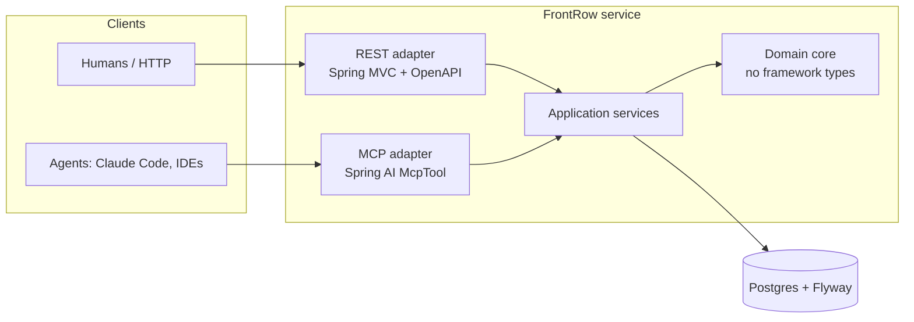
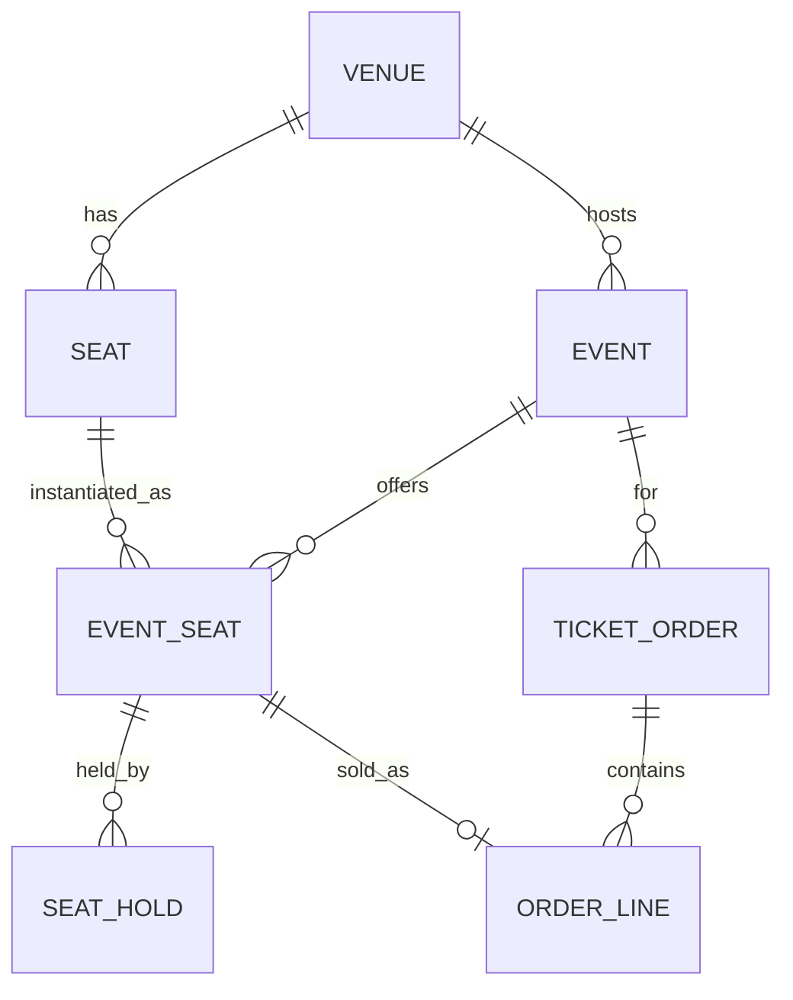

# FrontRow — Design Spec

**Date:** 2026-09-17
**Status:** Approved design. Not yet implemented — no code exists.
**Tier:** Standard (new project; no auth/RLS/public-contract work in Phase 1)

---

## 1. Why this project exists

FrontRow is a portfolio project with two specific, evidence-backed goals.

**Goal 1 — back an unbacked resume claim.** `Java` is listed under Backend
skills on the resume with no supporting project or work bullet. Infor was LPL
(Infor's proprietary language), RBC is SDET work in Playwright/Postman/
OpenShift, the SAIT capstone was Next.js, and Carpool was Laravel/PHP. Every
other listed skill has a bullet under it; Java is the one load-bearing claim
with nothing attached. This project converts it into a demonstrated skill.

**Goal 2 — demonstrate MCP server design, not just MCP usage.** Existing
portfolio work (The Fourth Official) covers the AI *consumer* side: retrieval,
evals, grounded generation. FrontRow covers the *provider* side: designing an
agent-facing API, tool boundaries, and guardrails on write operations.

These are one project rather than two because the architecture genuinely unites
them (see §3). The portfolio currently contains four JavaScript/TypeScript
projects and zero compiled-language backend services, so this fills a real gap
rather than adding a fifth variation of the same signal.

### Research basis

Design decisions below trace to published 2026 hiring signals:

- Implementation quality outranks idea originality; production hygiene (auth,
  real tests, containerization, DB migrations, concrete README metrics) is what
  gets evaluated.
- **Testcontainers** is repeatedly named as *the* differentiator separating
  strong from weak Spring developers — meaningful integration tests against a
  real database rather than mocking everything.
- **Observability** is absent from roughly 70% of Java resumes (Micrometer,
  Prometheus, Grafana, tracing) — a cheap differentiator, scheduled as Phase 2.
- A credible MCP portfolio has a specific published bar: typed JSON schemas
  checked into the repo, **at least one logged tool failure**, thin
  single-responsibility tools, structured error contracts, an architecture
  diagram with a threat model, and measured tool success rate / p95 latency.
  Weak signals are happy-path-only demos, "mega-tools" hiding business logic,
  unstructured output, and MCP on a resume with no server repo.

The MCP bar is, in substance, a testing-and-observability checklist. That plays
directly to SDET experience while reading as current AI work.

---

## 2. Goals and non-goals

### Goals

1. A working Spring Boot service with a defensible domain model and real
   business invariants.
2. Double-booking made **structurally impossible**, proven by a concurrency
   test against real Postgres.
3. An MCP server exposing the same domain, meeting the published credibility
   bar including a logged failure case.
4. Something complete and presentable within roughly one focused week.

### Non-goals

- **No frontend.** OpenAPI/Swagger UI plus seeded demo data plus the MCP server
  is the demo. Four existing portfolio projects already prove frontend ability;
  this one is deliberately backend-only so effort concentrates on the gap.
- **No real payments.** Order confirmation is simulated. Handling real payment
  credentials is out of scope and would add compliance surface for no portfolio
  gain.
- **No recurring performances.** One event = one datetime at one venue. A
  multi-performance model is a documented future enhancement, not a hidden gap.
- **No Kafka, observability stack, or OAuth2 in Phase 1.** All three are
  in-demand and all three are scheduled later (§9). Including them in a
  one-week Phase 1 produces a half-finished everything, which the research
  says is strictly worse than a small complete thing.

---

## 3. Architecture

A domain core with two inbound adapters. The core has no Spring Web types and
no MCP types in it; both adapters are thin translation layers over the same
application services.



**The load-bearing sentence:** MCP is just another inbound adapter — the domain
does not know it exists. A Java reviewer reads ports-and-adapters discipline; an
AI-platform reviewer reads a correct understanding of MCP as an interface layer
rather than a magic AI feature.

**Practical consequence for review:** if a change to an MCP tool requires
changing anything under the domain core, the boundary has leaked. That is a
concrete, checkable review criterion, not an aspiration.

---

## 4. Domain model



| Table | Key fields | Notes |
|---|---|---|
| `venue` | id, name | |
| `seat` | id, venue_id, section, row_label, seat_number | Physical seat, reused across events |
| `event` | id, venue_id, name, starts_at, sales_open_at, sales_close_at, status | One performance |
| `event_seat` | id, event_id, seat_id, price_cents, currency | A seat *for a given event*, with its price. Availability is derived here. |
| `seat_hold` | id, event_seat_id, hold_group_id, buyer_ref, status, expires_at, created_at | One row per held seat. `hold_group_id` groups seats held together. |
| `ticket_order` | id, event_id, buyer_ref, status, total_cents, currency, created_at | |
| `order_line` | id, order_id, event_seat_id, price_cents | One line per seat |

**Money is stored as `long` cents plus an ISO currency code**, wrapped in a
`Money` value object. Not `double` (precision), and not `BigDecimal` by default
(invites a rounding-mode discussion with no upside at this scale). Integer cents
is easy to defend in an interview.

**Hold status** is one of `ACTIVE`, `EXPIRED`, `CONVERTED`, `RELEASED`.

---

## 5. The core invariant: double-booking is structurally impossible

This is the technical centrepiece. The whole project's credibility rests here.

**The invariant lives in the schema, not in a service method:**

```sql
CREATE UNIQUE INDEX uq_active_hold_per_seat
    ON seat_hold (event_seat_id) WHERE status = 'ACTIVE';

ALTER TABLE order_line
    ADD CONSTRAINT uq_sold_once UNIQUE (event_seat_id);
```

Even if application logic is wrong, and under any amount of concurrency, the
database physically cannot record the same seat held twice or sold twice. The
application catches the constraint violation and translates it into a clean
`seat_taken` error rather than leaking a 500.

### Hold expiry — two mechanisms, deliberately

1. **Lazy expiry (correctness).** When a caller attempts to hold seats, any
   stale `ACTIVE` holds on those seats are transitioned to `EXPIRED` inside the
   same transaction before the new hold is attempted.
2. **Scheduled sweeper (hygiene).** A periodic job expires stale holds in bulk.

Correctness never depends on the scheduler running — the sweeper only keeps the
table tidy and keeps availability counts honest for read queries. Being able to
explain *why both exist* is worth more than either mechanism alone.

### The portfolio centrepiece test

N threads race to hold the same `event_seat` simultaneously. Assert exactly one
succeeds and every other caller receives `seat_taken`. Runs against real
Postgres via Testcontainers, not an in-memory database — an H2 test here would
prove nothing, since the behaviour under test is Postgres constraint
enforcement under concurrent transactions.

---

## 6. MCP tool design

Five thin, single-responsibility tools. Implemented with Spring AI's `@McpTool`
annotation, which generates the JSON schema from the method signature.

| Tool | Parameters | Access |
|---|---|---|
| `search_events` | query, from_date, to_date, limit | read |
| `get_event` | event_id | read |
| `check_availability` | event_id, section?, quantity? | read |
| `hold_seats` | event_id, seat_ids or (section + quantity), buyer_ref | **write, guarded** |
| `release_hold` | hold_group_id | write, safe |

### The threat model, in one line

**An agent can hold seats. Only a human can buy them.**

There is deliberately **no `confirm_order` MCP tool**. Holds are reversible and
expire on their own; purchases are neither. The confirmation step exists only on
the REST adapter, behind a human. This is the single most interview-valuable
decision in the project and should be stated prominently in the README.

### Guardrails on the write path

> **Dependency, stated explicitly:** the per-caller guardrails below require a
> trusted caller identity, which is open question 2 in §11 and is *not* yet
> resolved. Per-request caps work without it; per-caller caps do not. If §11.2
> is still unanswered when `hold_seats` is implemented, the per-caller caps must
> be dropped from Phase 1 rather than enforced against an untrusted,
> caller-supplied `buyer_ref` — which would be security theatre.

- Per-caller cap on simultaneously active hold groups (see dependency above)
- Per-request cap on seats per hold
- Idempotency key on `hold_seats` so a retried call does not create a second hold
- Tool traces logged with `buyer_ref` and any caller identifiers redacted
- Sales-window enforcement (no holds before `sales_open_at` or after `sales_close_at`)

### Error contracts

Structured, machine-parseable, always with a recovery hint:

```json
{"error": "seat_taken", "hint": "call check_availability for current seats"}
{"error": "not_found", "hint": "call search_events to find a valid event_id"}
{"error": "sales_closed", "hint": "this event is no longer on sale"}
{"error": "hold_limit_exceeded", "hint": "release an existing hold first"}
```

An unstructured string error is a review BLOCKER — it is one of the named weak
signals.

---

## 7. Evidence artifacts

These are deliverables, not documentation afterthoughts. They are what converts
"I built an MCP server" into a credible claim.

| Artifact | Path | Purpose |
|---|---|---|
| Tool schemas | `docs/mcp/tools/*.schema.json` | Typed schemas checked into version control |
| **Logged failure** | `logs/example_run.txt` | A real recorded error-and-recovery run |
| Architecture + threat model | `docs/mcp/architecture.md` | Host/client/server diagram, trust boundaries, why no `confirm_order` |
| README metrics | `README.md` | Concrete numbers, not adjectives |

**The logged failure run must be real, not fabricated.** The intended scenario:
an agent calls `hold_seats` for specific seats, one is taken between its
`check_availability` call and its `hold_seats` call, it receives `seat_taken`
with a hint, calls `check_availability` again, and successfully holds different
seats. Happy-path-only demos are an explicitly named weak signal; this artifact
is the cheapest high-contrast differentiator in the project.

---

## 8. Testing strategy

| Layer | Tooling | Covers |
|---|---|---|
| Domain unit tests | JUnit 5 + AssertJ | Hold state transitions, expiry logic, `Money` arithmetic, sales-window rules |
| Integration tests | Testcontainers + real Postgres | Repository behaviour, Flyway migrations apply cleanly, constraint violations surface correctly |
| **Concurrency test** | Testcontainers + executor pool | N threads racing one seat; exactly one winner |
| MCP contract tests | JSON schema assertions | Generated tool schemas match the checked-in `*.schema.json` files, so schema drift fails CI |

No mocking of the database. Testcontainers is the named differentiator and
mocking it away forfeits the entire signal.

---

## 9. Phasing

| Phase | Contents | Exit state |
|---|---|---|
| **1 — the week** | Domain core, REST + OpenAPI, Postgres + Flyway, Testcontainers suite incl. concurrency test, demo-grade security (below), all 5 MCP tools, all evidence artifacts, Docker, CI, seeded demo data | **Complete and presentable** |
| 2 | Observability: Micrometer + Prometheus + Grafana, MCP tool traces, measured tool success rate over 10 test prompts, p95 latency | Fills the "70% of resumes miss this" gap; completes the MCP metrics bar |
| 3 | Event-driven: transactional outbox + Kafka for `hold_expired` and `order_confirmed` events | Adds the in-demand Kafka signal |
| 4 | Optional thin UI | Clickable live demo |

**"Demo-grade security" is defined, not left vague:** Spring Security with
HTTP Basic and in-memory users carrying `BUYER`, `ORGANISER` and `ADMIN` roles,
protecting the REST adapter only. It exists to demonstrate that authorization
boundaries were considered and wired, not to be production authentication. The
README must say so plainly — overstating it is worse than omitting it. Real
authentication (OAuth2 / OIDC) is Phase 2 or later.

**Honest risk on Phase 1:** this is a full focused week, not a few days. If the
shorter end must be guaranteed, the trim is **demo-grade security and the
breadth of seeded demo data** — explicitly *not* the concurrency test or the MCP
evidence artifacts, which are the entire differentiating value of the project.

---

## 10. Stack

| Concern | Choice | Reason |
|---|---|---|
| Language | Java 25 (LTS) | Current LTS |
| Framework | Spring Boot 4.1 | Current; required by Spring AI 2.0 |
| MCP | Spring AI 2.0, `@McpTool` | First-class MCP server support; schema generated from method signatures |
| Transport | stdio **and** SSE (`spring-ai-starter-mcp-server-webmvc`) | stdio for Claude Code / CLI clients; SSE for IDE clients |
| Database | Postgres + Flyway | Partial unique indexes are required by §5; versioned migrations are a named hygiene signal |
| Build | Maven | More common than Gradle in enterprise Java shops, which is the target audience |
| Testing | JUnit 5, AssertJ, Testcontainers | Testcontainers is the named differentiator |
| API docs | springdoc-openapi | Swagger UI is the human-facing demo |
| Container / CI | Docker, GitHub Actions | Named production-hygiene signals |
| Deploy | Railway | Already used for The Fourth Official; known quantity |

**Versions must be verified against current releases at implementation time.**
Spring Boot 4.1 and Spring AI 2.0 GA (June 2026) are correct as of this spec's
date, but exact patch versions are to be pinned when the project is scaffolded.

---

## 11. Open questions for implementation

These are deliberately unresolved and should be decided during planning, not
assumed:

1. **Seat selection semantics for `hold_seats`.** Does the agent name specific
   `event_seat` ids, or ask for "3 seats together in section A" and let the
   service choose? Best-adjacent-seats allocation is a real algorithm and may
   not fit Phase 1. Specific-ids is the safe Phase 1 answer.
2. **Authentication for the MCP adapter.** stdio transport has no HTTP layer to
   put a filter in front of. How is `buyer_ref` established and trusted, and
   what stops one caller releasing another caller's hold? This must be answered
   before `release_hold` ships.
3. **Hold TTL value.** Needs to be long enough to be usable and short enough to
   make the concurrency demo meaningful. Probably configurable.
4. **Whether the sweeper runs in-process** (`@Scheduled`) or as a separate
   task. In-process is fine for Phase 1 but becomes wrong the moment there is
   more than one instance.

---

## 12. Definition of done for Phase 1

- [ ] `docker compose up` starts the service and Postgres; seeded demo data present
- [ ] Swagger UI browsable, every endpoint exercised end to end
- [ ] All 5 MCP tools callable from Claude Code over stdio
- [ ] Concurrency test passes against real Postgres and genuinely fails if the partial unique index is removed
- [ ] `logs/example_run.txt` contains a real, reproduced failure-and-recovery run
- [ ] Tool schemas checked in, and CI fails on schema drift
- [ ] README states the no-`confirm_order` decision and carries concrete metrics
- [ ] CI green on a clean checkout

---

## 13. Next steps

1. This spec is reviewed by the user.
2. Run the `new-project` skill to bootstrap the repo (git init, CLAUDE.md,
   settings, hooks, test framework, GitHub setup, quality baseline). **No code
   exists yet; nothing has been scaffolded.**
3. Run `superpowers:writing-plans` to turn Phase 1 into an implementation plan.
4. Record an ADR for the §5 schema-level-invariant decision and the §6
   no-`confirm_order` decision — both will constrain future work.

### Related, separate work

`the-fourth-official` has a captured follow-up idea to expose its retrieval
pipeline as a read-only MCP server (`docs/ideas/mcp-server-follow-up.md` in that
repo). The two MCP efforts are complementary: that one is a read-only retrieval
wrapper, this one is read+write tool design with guardrails. They are not
redundant and should not be merged.
